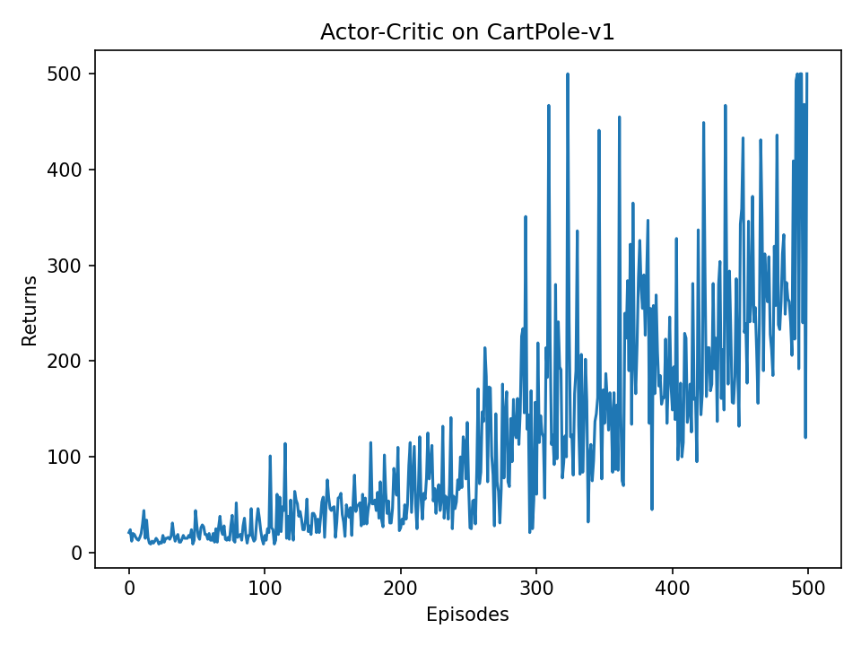
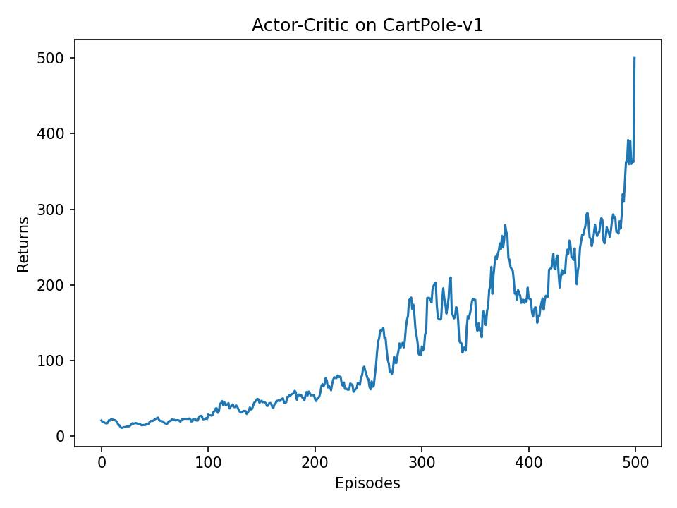

# Actor-Critic 实验报告

---

## 一、实验目标

本实验实现并验证基础 **Actor-Critic** 算法在经典控制任务 **CartPole-v1** 上的学习效果。Actor-Critic 是一种结合策略学习和值函数学习的强化学习框架：一方面使用 Actor 直接学习策略，另一方面使用 Critic 估计状态价值，并用价值估计结果指导 Actor 更新。

本实验代码文件为：

```text
Actor-Critic.py
```

运行命令为：

```bash
python Actor-Critic.py --num-episodes 500 --output-dir results
```

实验最终生成两张训练曲线：

```text
results/actor_critic_returns.png
results/actor_critic_returns_smoothed.png
```

---

## 二、核心原理

### 2.1 从策略梯度到 Actor-Critic

在 REINFORCE 等策略梯度算法中，智能体直接学习一个带参数的策略函数 $\pi_\theta(a\mid s)$，并通过采样得到的回报来更新策略。其基本思想是：如果某个动作最终带来了较高回报，就提高该动作在对应状态下被选择的概率。

但是，REINFORCE 使用完整轨迹回报作为学习信号，往往存在两个问题：

1. 必须等一整条轨迹结束后才能更新。
2. 蒙特卡洛回报方差较大，训练曲线容易波动。

Actor-Critic 在策略网络之外增加一个价值网络，用价值函数估计来降低方差。它仍然属于基于策略的方法，但同时学习：

| 模块 | 网络 | 输入 | 输出 | 作用 |
|------|------|------|------|------|
| Actor | PolicyNet | 状态 $s$ | 动作概率 $\pi(a\mid s)$ | 决定采取哪个动作 |
| Critic | ValueNet | 状态 $s$ | 状态价值 $V(s)$ | 评价当前状态好坏 |

其中 Actor 负责“行动”，Critic 负责“评价”。Actor 根据 Critic 给出的评价信号调整策略。

### 2.2 TD Target 与 TD Delta

本实验采用一步时序差分误差作为 Actor 的学习信号。

Critic 的学习目标为：

$$
y = r + \gamma V(s') (1 - done)
$$

其中：

- $r$ 表示当前步奖励。
- $\gamma$ 表示折扣因子。
- $V(s')$ 表示下一个状态的价值估计。
- $done$ 表示 episode 是否结束。

如果当前状态不是终止状态，则目标值包含未来状态价值；如果当前状态已经终止，则不再考虑未来回报。

TD 误差为：

$$
\delta = y - V(s)
$$

它反映当前动作带来的结果是否超出 Critic 原本预期：

- 若 $\delta > 0$，说明动作效果比预期好，Actor 应提高该动作概率。
- 若 $\delta < 0$，说明动作效果比预期差，Actor 应降低该动作概率。

### 2.3 损失函数

Actor 的损失函数为：

$$
\mathcal{L}_{actor} = -\log \pi(a\mid s) \cdot \delta
$$

代码中对应：

```python
actor_loss = (-log_probs * td_delta.detach()).mean()
```

其中 `td_delta.detach()` 的作用是将 TD 误差视为常数，避免 Actor 更新时反向传播影响 Critic 网络。

Critic 的损失函数为均方误差：

$$
\mathcal{L}_{critic} = \left(V(s) - y\right)^2
$$

代码中对应：

```python
critic_loss = F.mse_loss(values, td_target.detach())
```

Critic 通过最小化该损失，使 $V(s)$ 更接近 TD target。

---

## 三、代码结构

### 3.1 策略网络 PolicyNet

策略网络结构为两层全连接网络：

```text
输入状态 state_dim
    -> Linear(state_dim, hidden_dim)
    -> ReLU
    -> Linear(hidden_dim, action_dim)
    -> Softmax
输出每个动作的概率
```

在 CartPole-v1 中，状态维度为 4，动作数量为 2，因此 Actor 输出的是两个动作的概率：

```text
[向左推的概率, 向右推的概率]
```

代码中的核心前向传播为：

```python
def forward(self, x):
    x = F.relu(self.fc1(x))
    return F.softmax(self.fc2(x), dim=1)
```

### 3.2 价值网络 ValueNet

价值网络同样使用两层全连接网络：

```text
输入状态 state_dim
    -> Linear(state_dim, hidden_dim)
    -> ReLU
    -> Linear(hidden_dim, 1)
输出状态价值 V(s)
```

与策略网络不同，价值网络最后输出的是一个实数，不使用 softmax。该实数表示当前状态的预期长期回报。

### 3.3 动作选择

Actor 根据当前状态输出动作概率后，使用 `Categorical` 分布随机采样动作：

```python
probs = self.actor(state)
action_dist = torch.distributions.Categorical(probs=probs)
action = action_dist.sample().item()
```

这种方式不是总选择概率最大的动作，而是按照概率随机采样。这样可以保留一定探索性，避免策略过早固定在局部较差动作上。

### 3.4 参数更新

每一局 episode 结束后，程序将该局中所有 transition 保存为：

```python
transition_dict = {
    "states": [],
    "actions": [],
    "next_states": [],
    "rewards": [],
    "dones": [],
}
```

随后调用：

```python
agent.update(transition_dict)
```

更新过程包括：

1. 将采样数据转为 PyTorch 张量。
2. Critic 计算 $V(s)$ 与 $V(s')$。
3. 计算 TD target。
4. 计算 TD delta。
5. 使用 TD delta 更新 Actor。
6. 使用 TD target 更新 Critic。

完整训练流程可以概括为：

```text
初始化 Actor 和 Critic
For each episode:
    重置环境，得到初始状态 s
    While episode 未结束:
        Actor 根据 s 采样动作 a
        环境执行 a，得到 r, s', done
        保存 (s, a, r, s', done)
        s <- s'
    使用该 episode 的数据更新 Critic
    使用 TD delta 更新 Actor
```

---

## 四、实验设置

### 4.1 实验环境

本实验使用 Gymnasium 中的 CartPole-v1 环境。

| 项目 | 设置 |
|------|------|
| 环境 | CartPole-v1 |
| 状态维度 | 4 |
| 动作空间 | 离散动作，2 个动作 |
| 最大回报 | 500 |
| 任务目标 | 控制小车左右移动，使杆尽量保持不倒 |

CartPole-v1 的状态包含：

1. 小车位置。
2. 小车速度。
3. 杆的角度。
4. 杆的角速度。

动作空间包含：

1. 向左推小车。
2. 向右推小车。

### 4.2 超参数设置

| 超参数 | 数值 | 含义 |
|--------|------|------|
| `num_episodes` | 500 | 训练 episode 数 |
| `hidden_dim` | 128 | 隐藏层神经元数量 |
| `actor_lr` | 1e-3 | Actor 学习率 |
| `critic_lr` | 1e-2 | Critic 学习率 |
| `gamma` | 0.98 | 折扣因子 |
| `seed` | 0 | 随机种子 |
| `device` | cuda | 使用 GPU 训练 |

Critic 的学习率设置得比 Actor 更大，是因为 Critic 需要较快适应 Actor 产生的新数据分布。如果 Critic 学得太慢，Actor 得到的评价信号会不准确，训练可能变慢或波动更大。

---

## 五、实验结果

### 5.1 原始回报曲线

下图展示每个 episode 的总回报：



从原始曲线可以看出，训练初期回报较低，智能体尚未学会稳定控制小车。随着 episode 增加，回报逐渐上升，说明 Actor 在 Critic 的指导下逐步学习到了更好的控制策略。

训练后期曲线仍存在一定波动，这是因为策略网络使用随机采样动作，并且 Actor-Critic 本身是 on-policy 方法，每次更新依赖当前策略采样到的数据。

### 5.2 平滑回报曲线

下图为窗口大小为 9 的滑动平均曲线：



平滑曲线更清晰地反映了训练趋势。可以观察到：

1. 前 100 个 episode 左右，回报整体较低，处于探索和初步学习阶段。
2. 约 150 到 300 个 episode 之间，回报开始明显上升。
3. 训练后期回报继续提升，说明策略仍在改善。

本次 500 episode 实验的最终输出为：

```text
Last 10 episode mean return: 373.600
```

这说明经过 500 个 episode 训练后，智能体已经能够在多数 episode 中保持较长时间不失败，但尚未完全稳定达到 CartPole-v1 的满分 500。若继续训练到 1000 episode，或进一步调节学习率、网络结构、优势估计方式，通常可以继续提高最终表现。

---

## 六、结果分析

### 6.1 Actor-Critic 的学习效果

实验结果表明，基础 Actor-Critic 能够在 CartPole-v1 上有效学习控制策略。相比纯随机策略，训练后的智能体回报显著提升，说明策略网络已经从环境交互中学到了有用的动作选择规律。

该算法的关键在于 Critic 提供了比完整轨迹回报更及时的学习信号。每一局结束后，Critic 用一步 TD 目标学习状态价值，Actor 则利用 TD delta 判断某个动作是否优于当前价值估计。

### 6.2 训练波动原因

虽然总体趋势上升，但曲线仍存在波动，主要原因包括：

1. Actor 使用概率采样动作，相同状态下也可能采样到不同动作。
2. 每次更新只使用当前策略采样的数据，样本相关性较强。
3. Critic 的价值估计并非完全准确，Actor 可能被不稳定的 TD delta 影响。
4. CartPole-v1 的 episode 长度随着策略变好而增加，后期每局数据分布也在不断变化。

这些现象是基础 on-policy Actor-Critic 中比较常见的。后续的 A2C、A3C、PPO 等算法都可以看作是在该框架上进一步提高稳定性和样本效率。

### 6.3 与 DQN 的区别

DQN 是基于值函数的方法，主要学习 $Q(s,a)$，再通过最大 Q 值选择动作。它通常使用经验回放和目标网络来稳定训练。

Actor-Critic 与 DQN 的主要区别如下：

| 对比项 | DQN | Actor-Critic |
|--------|-----|--------------|
| 算法类型 | 基于值函数 | 基于策略，同时学习价值函数 |
| 学习对象 | 动作价值 $Q(s,a)$ | 策略 $\pi(a\mid s)$ 和状态价值 $V(s)$ |
| 动作选择 | 通常使用 $\epsilon$-greedy | 根据策略概率采样 |
| 是否 on-policy | 常见 DQN 为 off-policy | 本实验为 on-policy |
| 是否使用经验回放 | 使用 | 本实验不使用 |

Actor-Critic 的优势是可以直接学习随机策略，并且更容易扩展到连续动作空间；DQN 的优势是结构清晰，在离散动作任务中配合经验回放和目标网络通常较稳定。

### 6.4 与 REINFORCE 的区别

REINFORCE 使用完整轨迹回报更新策略，属于蒙特卡洛方法。Actor-Critic 使用 Critic 的 TD 误差更新策略，属于 bootstrap 方法。

| 对比项 | REINFORCE | Actor-Critic |
|--------|-----------|--------------|
| 策略更新信号 | 完整轨迹回报 | TD delta |
| 是否学习价值函数 | 否 | 是 |
| 方差 | 较大 | 通常较小 |
| 更新稳定性 | 容易波动 | 相对更稳定 |
| 是否需要等轨迹结束 | 通常需要 | 可以扩展为每步更新 |

本实验实现中仍然是在一局结束后统一更新，但每一步的学习信号来自 TD target，而不是完整轨迹回报。

---

## 七、总结

本实验完成了基础 Actor-Critic 算法在 CartPole-v1 上的实现与测试。实验结果显示，Actor-Critic 能够通过 Actor 与 Critic 的协同学习逐步提升控制能力，500 个 episode 后最近 10 局平均回报达到 373.600，说明算法已经学习到较有效的策略。

本实验的主要收获如下：

1. Actor-Critic 将策略学习和值函数学习结合起来，Actor 负责选择动作，Critic 负责评价动作效果。
2. TD delta 是连接 Actor 和 Critic 的关键信号，它告诉 Actor 当前动作是否比预期更好。
3. `detach()` 在代码中非常重要，可以防止 Actor 更新时错误影响 Critic 的梯度计算。
4. 基础 Actor-Critic 能有效学习 CartPole，但仍有一定波动，训练稳定性不如后续改进算法。
5. 该结构是 PPO、DDPG、SAC 等更复杂强化学习算法的重要基础。

后续可以尝试的改进包括：

1. 将一局结束后更新改为每一步在线更新。
2. 引入优势归一化，降低梯度方差。
3. 使用 n-step return 或 GAE 改进优势估计。
4. 增加训练 episode 数到 1000 或更高。
5. 对比 REINFORCE、DQN 和 Actor-Critic 在同一环境下的收敛速度。

---

## 参考资料

[1] Sutton, R. S., & Barto, A. G. (2018). *Reinforcement Learning: An Introduction*.

[2] Konda, V. R., & Tsitsiklis, J. N. (2000). Actor-Critic Algorithms.

[3] 动手学强化学习：第 10 章 Actor-Critic 算法。
