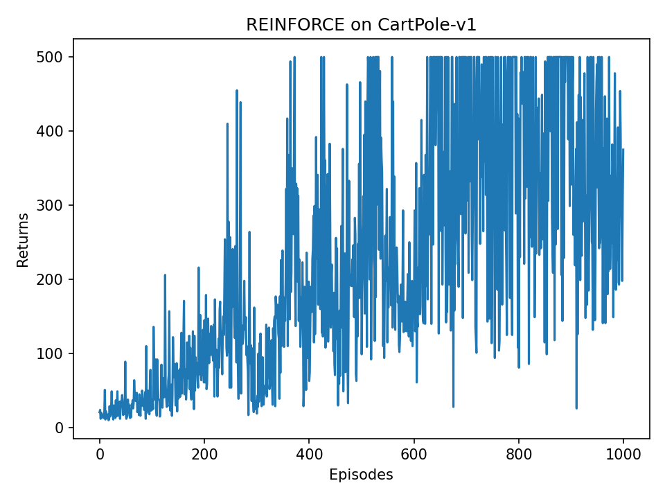
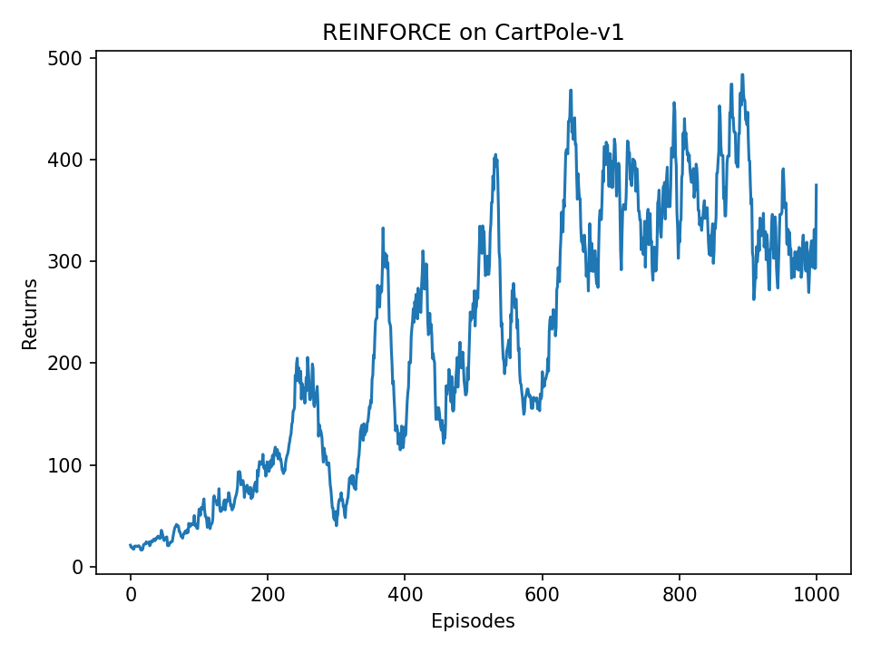

# REINFORCE 实验报告

---

## 一、实验目的

本实验在经典控制环境 `CartPole-v1` 上实现并测试 REINFORCE 算法。实验目标包括：

1. 理解策略梯度方法与基于价值方法的区别。
2. 掌握 REINFORCE 如何用完整轨迹的蒙特卡洛回报更新策略网络。
3. 在 PyTorch 中实现一个可运行的随机策略网络。
4. 观察 REINFORCE 在 CartPole 环境中的学习曲线和训练稳定性。

REINFORCE 是最基础的策略梯度算法之一。它不再像 Q-learning 或 DQN 那样先学习动作价值函数 $Q(s,a)$，再由价值函数间接得到策略，而是直接学习一个参数化策略 $\pi_\theta(a\mid s)$。策略网络输入状态，输出每个动作被选择的概率，然后智能体根据该概率分布随机采样动作。

---

## 二、算法原理

### 2.1 从价值方法到策略方法

DQN 属于 value-based 方法。它学习的是动作价值函数：

$$
Q(s,a)
$$

然后通过

$$
a = \arg\max_a Q(s,a)
$$

选择动作。也就是说，DQN 的策略是从价值函数中“推出来”的。

REINFORCE 属于 policy-based 方法。它直接学习策略：

$$
\pi_\theta(a\mid s)
$$

其中 $\theta$ 是神经网络参数，$\pi_\theta(a\mid s)$ 表示在状态 $s$ 下选择动作 $a$ 的概率。

在 CartPole 中，动作空间是离散的，只有两个动作：

| 动作编号 | 含义 |
|---|---|
| 0 | 向左推小车 |
| 1 | 向右推小车 |

因此策略网络的输出可以写成：

$$
\pi_\theta(\cdot\mid s) = [P(a=0\mid s), P(a=1\mid s)]
$$

例如网络输出 `[0.3, 0.7]`，表示智能体有 30% 概率向左推，70% 概率向右推。

### 2.2 Softmax 概率策略

策略网络最后一层先输出每个动作的原始分数：

$$
z = [z_1, z_2, \ldots, z_n]
$$

这些分数本身不是概率，因为它们可能为负，也不一定加和为 1。为了把动作分数变成概率分布，代码中使用 softmax：

$$
\text{softmax}(z_i) =
\frac{e^{z_i}}{\sum_j e^{z_j}}
$$

softmax 的作用是：

1. 每个输出值都大于 0。
2. 所有输出值加起来等于 1。
3. 原始分数越大的动作，转换后的概率越大。

代码实现如下：

```python
def forward(self, x):
    x = F.relu(self.fc1(x))
    return F.softmax(self.fc2(x), dim=1)
```

其中 `dim=1` 表示对动作维度做 softmax。由于输入通常是一个 batch，网络输出形状为 `[batch_size, action_dim]`，因此第 1 维正好对应动作。

### 2.3 策略梯度目标

强化学习的目标是最大化期望回报：

$$
J(\theta) = \mathbb{E}_{\pi_\theta}[G]
$$

其中 $G$ 是从当前时刻开始往后的折扣累计回报：

$$
G_t = r_t + \gamma r_{t+1} + \gamma^2 r_{t+2} + \cdots
$$

REINFORCE 使用如下策略梯度估计：

$$
\nabla_\theta J(\theta)
=
\mathbb{E}_{\pi_\theta}
\left[
G_t \nabla_\theta \log \pi_\theta(a_t\mid s_t)
\right]
$$

直观理解：

- 如果某一步动作后面带来了较高回报 $G_t$，就提高当时选择该动作的概率。
- 如果某一步动作后面回报较低，就相对降低该动作以后被选择的概率。

PyTorch 优化器默认执行梯度下降，而策略梯度本身希望最大化回报，所以在代码中将损失函数写成：

$$
L(\theta) = -G_t \log \pi_\theta(a_t\mid s_t)
$$

也就是：

```python
losses.append(-log_prob * G)
```

最小化这个负号形式的 loss，就等价于最大化策略期望回报。

### 2.4 REINFORCE 算法流程

REINFORCE 是 on-policy 算法，必须使用当前策略采样出来的数据更新当前策略。其基本流程如下：

```text
初始化策略网络参数 theta

for 每一个 episode:
    用当前策略 pi_theta 与环境交互，采样一整条轨迹
    得到 states, actions, rewards

    G = 0
    从最后一步往前遍历轨迹:
        G = reward + gamma * G
        计算 log pi_theta(action | state)
        构造 loss = -log_prob * G

    对所有时间步的 loss 求和
    反向传播并更新策略网络
```

与 DQN 相比，REINFORCE 没有经验回放池，也没有目标网络。它每收集完一整局数据，就立刻用这一整局轨迹更新一次策略。

---

## 三、代码架构

本实验代码文件为：

```text
Reinforce/Reinforce.py
```

整体结构如下：

```text
PolicyNet
    策略网络，输入状态，输出动作概率

REINFORCE
    take_action：根据概率分布采样动作
    update：根据一整条轨迹更新策略网络

train
    负责训练循环，收集轨迹并调用 agent.update

plot_returns
    保存原始回报曲线和平滑回报曲线

main
    读取参数，创建环境和智能体，启动训练
```

### 3.1 策略网络 PolicyNet

本实验使用两层全连接神经网络：

```text
输入层: state_dim = 4
    -> Linear(state_dim, hidden_dim)
    -> ReLU
    -> Linear(hidden_dim, action_dim)
    -> Softmax
输出层: action_dim = 2
```

CartPole 的状态维度为 4：

| 状态变量 | 含义 |
|---|---|
| cart position | 小车位置 |
| cart velocity | 小车速度 |
| pole angle | 杆子角度 |
| pole angular velocity | 杆子角速度 |

核心代码：

```python
class PolicyNet(torch.nn.Module):
    def __init__(self, state_dim, hidden_dim, action_dim):
        super().__init__()
        self.fc1 = torch.nn.Linear(state_dim, hidden_dim)
        self.fc2 = torch.nn.Linear(hidden_dim, action_dim)

    def forward(self, x):
        x = F.relu(self.fc1(x))
        return F.softmax(self.fc2(x), dim=1)
```

### 3.2 动作采样

策略网络输出的是动作概率，因此不能直接使用 `argmax` 固定选择最大概率动作，而是使用 `torch.distributions.Categorical` 按概率采样：

```python
probs = self.policy_net(state)
action_dist = torch.distributions.Categorical(probs)
action = action_dist.sample()
```

这种随机采样方式使智能体在训练早期仍然具有探索能力。如果某个动作概率为 0.7，它更容易被选择，但不是每次都被选择。

### 3.3 策略更新

`update` 函数是 REINFORCE 的核心。它从最后一步往前计算折扣回报：

```python
G = self.gamma * G + reward_list[i]
```

然后计算当前状态下，当时实际执行动作的对数概率：

```python
probs = self.policy_net(state)
action_dist = torch.distributions.Categorical(probs)
log_prob = action_dist.log_prob(action)
```

最后构造策略梯度损失：

```python
losses.append(-log_prob * G)
```

一整条轨迹上的损失相加后执行反向传播：

```python
loss = torch.stack(losses).sum()
loss.backward()
self.optimizer.step()
```

### 3.4 Gymnasium 兼容处理

新版 `gymnasium` 的 `reset` 和 `step` 返回格式与旧版 `gym` 不完全相同，因此代码中封装了两个函数：

```python
reset_env(env, seed=None)
step_env(env, action)
```

这样训练循环只需要使用统一格式：

```python
state = reset_env(env)
next_state, reward, done, _ = step_env(env, action)
```

---

## 四、实验设置

### 4.1 实验环境

| 项目 | 设置 |
|---|---|
| 环境 | `CartPole-v1` |
| 状态空间 | 连续状态，维度为 4 |
| 动作空间 | 离散动作，数量为 2 |
| 算法 | REINFORCE |
| 深度学习框架 | PyTorch |
| 环境库 | Gymnasium |

CartPole 的任务是控制小车左右移动，使竖直杆尽可能长时间保持不倒。每坚持一个时间步通常获得 1 分奖励，`CartPole-v1` 的单局最高回报为 500。

### 4.2 超参数设置

| 超参数 | 取值 | 含义 |
|---|---:|---|
| `num_episodes` | 1000 | 训练回合数 |
| `hidden_dim` | 128 | 策略网络隐藏层宽度 |
| `learning_rate` | 1e-3 | Adam 学习率 |
| `gamma` | 0.98 | 折扣因子 |
| `seed` | 0 | 随机种子 |
| `optimizer` | Adam | 优化器 |

运行命令：

```powershell
python .\Reinforce\Reinforce.py
```

也可以减少训练回合数做快速测试：

```powershell
python .\Reinforce\Reinforce.py --num-episodes 5
```

---

## 五、实验结果

训练完成后，程序保存了两张学习曲线图：

### 5.1 原始回报曲线



原始回报曲线记录了每个 episode 的总回报。由于 REINFORCE 使用整条轨迹的蒙特卡洛回报进行更新，梯度估计方差较大，因此训练曲线通常会有明显波动。

### 5.2 平滑回报曲线



平滑曲线使用窗口大小为 9 的移动平均处理，可以更清楚地观察整体学习趋势。随着训练进行，智能体能够逐渐学会在 CartPole 中保持平衡，回报整体呈上升趋势。

---

## 六、结果分析

### 6.1 学习效果

从学习曲线可以看出，REINFORCE 能够在 CartPole 任务中学习到有效策略。训练初期，策略网络参数接近随机，智能体左右推动作没有明确规律，单局回报较低。随着轨迹数据不断被用于更新策略，网络逐渐提高高回报动作序列的概率，回报随之上升。

这一现象符合策略梯度的基本思想：如果某一次采样轨迹得到较高回报，那么该轨迹中被执行动作的概率会被整体提高；反之，低回报轨迹对策略的强化较弱。

### 6.2 波动原因

REINFORCE 的回报曲线往往比 DQN 更容易波动，主要原因包括：

1. **蒙特卡洛回报方差较大**  
   每一步的更新依赖从该步开始到 episode 结束的完整回报 $G_t$。单条轨迹的随机性会直接影响梯度方向。

2. **样本利用率较低**  
   REINFORCE 是 on-policy 算法，当前轨迹只用于当前策略的一次更新，不能像 DQN 那样放入 replay buffer 多次复用。

3. **没有基线函数降低方差**  
   本实验实现的是基础 REINFORCE，没有引入 value baseline。如果加入状态价值函数 $V(s)$，使用优势函数 $A(s,a)=G_t-V(s)$，通常可以显著降低训练波动，这也是 Actor-Critic 方法的核心动机。

### 6.3 与 DQN 的对比

| 对比项 | DQN | REINFORCE |
|---|---|---|
| 方法类型 | 基于价值 | 基于策略 |
| 学习目标 | $Q(s,a)$ | $\pi_\theta(a\mid s)$ |
| 动作选择 | $\arg\max Q(s,a)$ 或 $\epsilon$-greedy | 按策略概率采样 |
| 是否 on-policy | 通常 off-policy | on-policy |
| 是否使用经验回放 | 使用 | 不使用 |
| 更新时机 | 每步或每若干步 | 每个 episode 结束 |
| 主要问题 | Q 值过估计、训练目标不稳定 | 梯度方差大、样本利用率低 |

DQN 通过经验回放和目标网络提高训练稳定性；REINFORCE 则直接优化策略目标，形式更简单，但在样本效率和稳定性上通常不如改进后的 Actor-Critic 类算法。

---

## 七、实验结论

本实验完成了基于 PyTorch 和 Gymnasium 的 REINFORCE 算法实现，并在 `CartPole-v1` 环境上进行了训练测试。实验表明：

1. REINFORCE 可以直接学习随机策略，不需要显式估计动作价值函数。
2. softmax 策略网络能够自然输出离散动作空间上的概率分布。
3. 使用完整轨迹的折扣回报可以构造策略梯度损失，实现对策略网络的更新。
4. REINFORCE 在简单控制任务上能够学习到有效策略，但训练曲线存在较大波动。
5. 波动的根本原因在于蒙特卡洛估计方差较高、样本只能在线使用一次。

后续可以在本实验基础上加入 baseline，或者进一步实现 Actor-Critic 算法，用价值函数估计降低策略梯度方差，从而提升训练稳定性。

---

## 八、参考文献

[1] Williams, R. J. (1992). Simple statistical gradient-following algorithms for connectionist reinforcement learning. *Machine Learning*, 8, 229-256.

[2] Sutton, R. S., McAllester, D., Singh, S., & Mansour, Y. (2000). Policy gradient methods for reinforcement learning with function approximation. *Advances in Neural Information Processing Systems*.

[3] Sutton, R. S., & Barto, A. G. (2018). *Reinforcement Learning: An Introduction*.

[4] 动手学强化学习：第 9 章 策略梯度算法，REINFORCE 代码实践。
