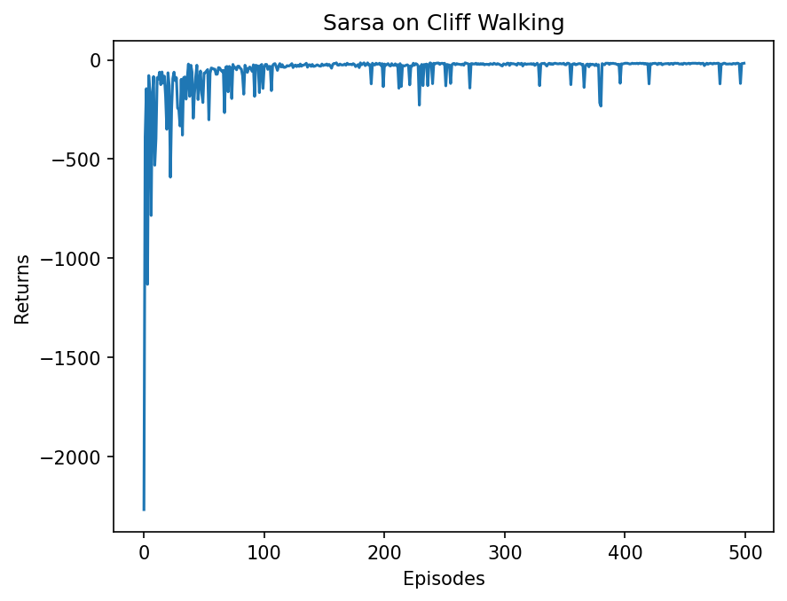
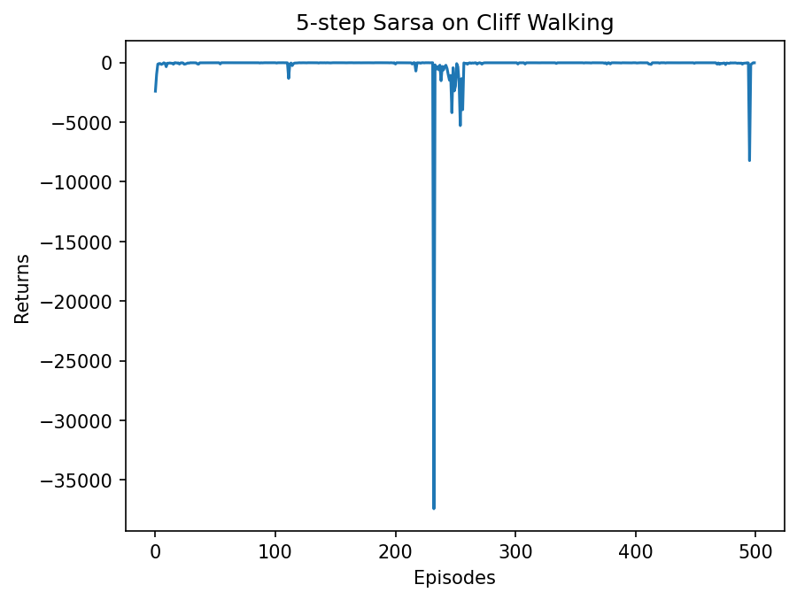
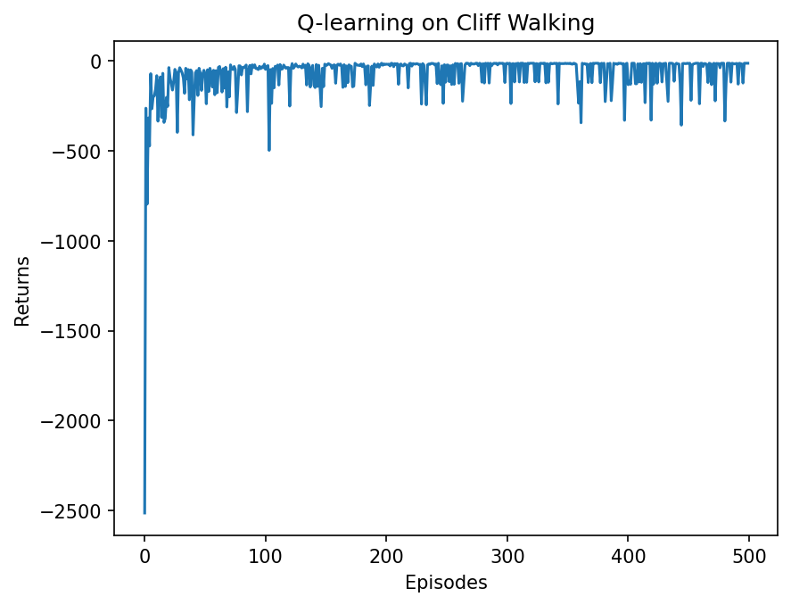

# 时序差分学习实验报告

---

## 一、核心机理（时序差分方法）

### 1.1 从蒙特卡洛到时序差分

在强化学习中，如何从与环境的交互中学习价值函数是核心问题。蒙特卡洛（MC）方法必须等到一个完整回合结束后，才能用实际累积回报来更新价值估计；而动态规划（DP）虽然可以逐步更新，但需要已知环境的完整模型。**时序差分（Temporal Difference, TD）方法**恰好兼顾了两者的优点：

- 像 MC 一样，直接从与环境的交互中采样学习，无需环境模型
- 像 DP 一样，利用**自举（bootstrapping）**——只需当前步结束即可进行计算，无需等待整个回合完成

TD(0) 的核心更新公式为：

$$V(s_t) \leftarrow V(s_t) + \alpha \underbrace{\left[ \underbrace{r_t + \gamma V(s_{t+1})}_{\text{TD 目标}} - V(s_t) \right]}_{\text{TD 误差 } \delta_t}$$

TD 目标 $r_t + \gamma V(s_{t+1})$ 用下一步的估计价值代替了 MC 中的完整回报，这正是"时序差分"名称的来源——利用**前后时刻价值估计之差**来驱动更新。

### 1.2 实验环境：悬崖漫步（Cliff Walking）

本实验使用经典的**悬崖漫步**问题，这是一个专门设计用来凸显不同 TD 算法行为差异的环境。具体设置如下：

- **网格大小**：4 行 × 12 列，共 48 个状态
- **起点**：左下角，对应状态索引 36
- **终点**：右下角，对应状态索引 47
- **悬崖**：底行中间 10 格（状态 37~46），踩入则获得 $-100$ 惩罚并被立即传送回起点，但回合**不结束**
- **普通移动**：每步惩罚 $-1$
- **动作空间**：上/下/左/右 共 4 个离散动作，撞墙时保持原位

该环境的关键矛盾在于：**最短路径（紧贴悬崖底部）风险最高，而安全路径（绕行上方）步数更多但不会踩崖**。这种设计使得 on-policy 和 off-policy 算法在最终收敛策略上产生显著分歧，是强化学习教学中最经典的对比实验之一。

### 1.3 性能评估

本实验以每回合的**累积原始回报**（不乘折扣因子）作为主要评估指标：

$$G = \sum_{t=0}^{T} r_t$$

沿最优路径（第三行直走，共13步）的理论回报为 $-13$；绕行更安全的第二行约为 $-17$。回报越接近 0，说明路径越短、踩崖次数越少。

---

## 二、关键算法设计

### 2.1 Sarsa（on-policy TD 控制）

Sarsa 是一种**同策略（on-policy）**的 TD 控制算法，其名称正是来源于更新所依赖的五元组：$\boldsymbol{(S_t,\ A_t,\ R_{t+1},\ S_{t+1},\ A_{t+1})}$。

**更新公式**：

$$Q(s_t, a_t) \leftarrow Q(s_t, a_t) + \alpha \left[ r_t + \gamma Q(s_{t+1}, a_{t+1}) - Q(s_t, a_t) \right]$$

这里的关键在于：$a_{t+1}$ 是由**当前 ε-贪婪行为策略**在 $s_{t+1}$ 上实际采样得到的动作，而非理论最优动作。正因为如此，Sarsa 评估的是带有探索噪声的**行为策略本身**的价值——悬崖旁的格子在 ε 概率的随机动作下有一定概率踩崖，这部分风险被纳入了 Q 值估计，导致智能体主动回避悬崖边缘，倾向于走远离悬崖的保守路线。

由于需要在更新时用到 $a_{t+1}$，Sarsa 的训练循环必须在进入主循环前就预先选好第一个动作（这是与 Q-learning 循环结构上最直观的区别）：

```python
state = env.reset()
action = agent.take_action(state)      # 预先选好 a_0
while not done:
    next_state, reward, done = env.step(action)
    next_action = agent.take_action(next_state)    # ε-贪婪选 a_{t+1}
    agent.update(state, action, reward, next_state, next_action)
    state, action = next_state, next_action
```

### 2.2 n 步 Sarsa（n-step Sarsa）

标准 Sarsa 是 TD(0)，每次只向前看一步。**n 步 Sarsa** 将这一视野扩展到 $n$ 步，先积累 $n$ 个时间步的真实奖励，再进行一次自举：

$$G_t^{(n)} = r_t + \gamma r_{t+1} + \cdots + \gamma^{n-1} r_{t+n-1} + \gamma^n Q(s_{t+n}, a_{t+n})$$

**更新公式**：

$$Q(s_t, a_t) \leftarrow Q(s_t, a_t) + \alpha \left[ G_t^{(n)} - Q(s_t, a_t) \right]$$

当 $n=1$ 时退化为普通 Sarsa，当 $n \to \infty$ 时退化为蒙特卡洛。$n$ 步方法在偏差（n 小时自举误差大）和方差（n 大时累积真实奖励方差大）之间提供了连续的权衡空间。本实验取 $n=5$，相比 1 步 Sarsa 使用了更多真实奖励，信用分配更准确，收敛速度也因此更快。

实现上需要维护长度为 $n$ 的状态/动作/奖励缓冲队列：缓冲区满后从队头弹出并执行更新；回合结束时，对缓冲区中残余的不足 $n$ 步的片段逐一处理，确保所有经历都被充分利用。

### 2.3 Q-learning（off-policy TD 控制）

Q-learning 是一种**异策略（off-policy）**的 TD 控制算法，由 Watkins（1989）提出，是强化学习历史上最重要的算法之一。

**更新公式**：

$$Q(s_t, a_t) \leftarrow Q(s_t, a_t) + \alpha \left[ r_t + \gamma \max_{a'} Q(s_{t+1}, a') - Q(s_t, a_t) \right]$$

与 Sarsa 的本质区别：TD 目标中使用的是 $\max_{a'} Q(s_{t+1}, a')$，即下一状态上所有动作的**贪婪最优价值**，与实际执行的动作无关。这意味着 Q-learning 的更新方向始终朝向**最优策略**，而用于收集数据的 ε-贪婪行为策略仅仅是探索手段，并不影响 Q 值的收敛目标。

off-policy 的一个重要优势在于：**Q-learning 的更新并非必须使用当前贪婪策略采样的数据**，历史经验可以被反复利用，样本效率更高。这一特性是后来经验回放（Experience Replay）机制的理论基础，也是深度 Q 网络（DQN）的核心组件之一。

---

## 三、关键超参数

| 超参数 | 含义 | 本实验取值 |
|--------|------|-----------|
| `ncol` | 网格列数 | 12 |
| `nrow` | 网格行数 | 4 |
| `epsilon (ε)` | ε-贪婪策略的探索概率 | 0.1 |
| `alpha (α)` | 学习率，控制每次更新的步长 | 0.1 |
| `gamma (γ)` | 折扣因子，对未来奖励的衰减程度 | 0.9 |
| `n_step` | n 步 Sarsa 的步长 $n$ | 5 |
| `num_episodes` | 总训练回合数 | 500 |

---

## 四、实验结果

### 4.1 Sarsa



**训练曲线**：Sarsa 的回报在前 50 回合波动极为剧烈，原始 Q 表全零导致策略近乎随机，第 10 回合的移动平均回报低至约 $-576$。随着 Q 值积累有效信息，曲线在第 100~150 回合迅速上升，此后进入相对平稳的收敛阶段，最终稳定在 $-20$ 到 $-30$ 左右。

| 训练阶段（末尾10回合均值） | 回报 |
|---|---|
| ep 10 | -576.2 |
| ep 50 | -138.8 |
| ep 100 | -71.5 |
| ep 150 | -28.3 |
| ep 300 | -22.6 |
| ep 500 | -28.6 |

**最终收敛策略**：

```
ooo>  ooo>  ooo>  ooo>  ooo>  ooo>  ooo>  ooo>  ooo>  ooo>  ooo>  ovoo
^ooo  ^ooo  ^ooo  ooo>  ooo>  ooo>  ooo>  ooo>  ooo>  ooo>  ooo>  ovoo
^ooo  ^ooo  ^ooo  ^ooo  ^ooo  ^ooo  oo<o  oo<o  ooo>  ^ooo  ooo>  ovoo
^ooo  ****  ****  ****  ****  ****  ****  ****  ****  ****  ****  EEEE
```

策略分析：第三行（紧邻悬崖上方）的大部分格子指向上（`^`），说明智能体倾向于先爬升到第二行再向右行进，彻底远离悬崖区域。这正是 on-policy 方法的典型表现：ε-贪婪策略下悬崖旁的随机踩崖风险被纳入 Q 值估计，智能体主动选择在最远离悬崖的一侧行走，以回避探索风险。

---

### 4.2 5 步 Sarsa



**训练曲线**：5 步 Sarsa 的收敛速度显著快于 1 步 Sarsa——第 50 回合的移动平均回报已达 $-19.8$，而此时 1 步 Sarsa 仍在 $-138.8$。这直接验证了 n 步方法在信用分配上的优势：5 步真实奖励让"踩崖后 $-100$ 惩罚"的信号得以向前快速传播，Q 值在更少回合内便收敛到正确方向。

| 训练阶段（末尾10回合均值） | 回报 |
|---|---|
| ep 10 | -441.2 |
| ep 50 | **-19.8** |
| ep 100 | -18.5 |
| ep 200 | -22.0 |
| ep 300 | -21.1 |
| ep 500 | -874.2 |

需要特别指出的是，5 步 Sarsa 在训练中出现了若干极端离群值（如第 240 回合均值达 $-4121$、最后一批次 $-874$）。这是 n 步方法的已知风险：当 Q 表处于局部错误状态时，智能体可能陷入长时间绕路甚至反复踩崖的循环，累积大量负奖励才得以退出。这一现象在 1 步 Sarsa 中几乎不会出现，因为单步更新的反应速度更快。

**最终收敛策略**：

```
ooo>  ooo>  ovoo  ooo>  ooo>  ooo>  ooo>  ooo>  ooo>  ooo>  ooo>  ovoo
^ooo  ^ooo  ooo>  ^ooo  ^ooo  ^ooo  ooo>  ^ooo  ^ooo  oo<o  ooo>  ovoo
^ooo  ^ooo  ^ooo  ^ooo  ^ooo  ^ooo  ^ooo  ^ooo  ^ooo  ^ooo  ooo>  ovoo
^ooo  ****  ****  ****  ****  ****  ****  ****  ****  ****  ****  EEEE
```

策略分析：第三行几乎全部指向上（`^`），即智能体从底行附近的格子统一选择向上撤离，绕行更高处后再向右，与 1 步 Sarsa 的保守倾向一致。这再次印证了 on-policy 框架下，增加步长 n 并不改变策略的安全保守性，仅影响收敛速度。

---

### 4.3 Q-learning



**训练曲线**：Q-learning 的回报波动在整个训练过程中持续存在，即便在后期 Q 值已接近收敛，移动平均回报仍频繁在 $-20$ 到 $-100$ 之间大幅震荡。原因在于 Q-learning 所学的最优路径紧贴悬崖第三行，以 ε=0.1 执行探索时随机动作极易踩崖获得 $-100$ 惩罚——**最优路径与最高风险路径在此环境中重合**，这是 Q-learning 训练曲线难以平稳的结构性根源。

| 训练阶段（末尾10回合均值） | 回报 |
|---|---|
| ep 10 | -525.1 |
| ep 50 | -133.4 |
| ep 100 | -35.3 |
| ep 200 | -22.4 |
| ep 300 | -25.2 |
| ep 500 | -36.3 |

值得注意的是：在同等训练阶段，**Sarsa 的训练期期望回报高于 Q-learning**。这并不意味着 Sarsa 找到了更好的策略，而恰恰相反——Q-learning 为了追求最优策略，行为策略本身风险更高，训练代价更大，这正是 off-policy 方法"以训练代价换最优性"的体现。

**最终收敛策略**：

```
^ooo  ovoo  ooo>  ^ooo  ^ooo  ooo>  oo<o  ^ooo  oo<o  ovoo  ooo>  ovoo
ovoo  ooo>  ovoo  ovoo  ooo>  ooo>  ooo>  ooo>  ooo>  ooo>  ooo>  ovoo
ooo>  ooo>  ooo>  ooo>  ooo>  ooo>  ooo>  ooo>  ooo>  ooo>  ooo>  ovoo
^ooo  ****  ****  ****  ****  ****  ****  ****  ****  ****  ****  EEEE
```

策略分析：第三行（索引2，紧邻悬崖上方）全部指向右（`ooo>`），说明 Q-learning 收敛到了沿第三行向右直走、到达终点列后向下的路径。相比 Sarsa 沿第二行绕行，这条路径更短，但与悬崖仅有一格之隔。上方两行的策略较混乱，说明那些远离悬崖的状态被访问次数不多，Q 值尚未充分收敛——对于最优策略而言，这些状态本就无需经过，因此混乱是正常的。

---

### 4.4 三种算法横向对比

| 对比维度 | Sarsa | 5 步 Sarsa | Q-learning |
|----------|-------|------------|------------|
| 策略类型 | on-policy | on-policy | off-policy |
| ep 50 均值回报 | -138.8 | **-19.8** | -133.4 |
| ep 200 均值回报 | -32.6 | -22.0 | -22.4 |
| ep 500 均值回报 | -28.6 | -874.2 | -36.3 |
| 训练稳定性 | 中等，后期较平稳 | 快速收敛但有极端离群值 | 全程高波动 |
| 最终收敛路径 | 第二行（远离悬崖） | 第二行（远离悬崖） | 第三行（紧贴悬崖） |
| 理论最优性 | 次优（安全路线） | 次优（安全路线） | 最优（最短路线） |
| 样本效率 | 较低 | 中等 | 较高（可复用历史数据） |

这一对比揭示了强化学习中一个深刻的权衡：**on-policy 方法为了安全而牺牲了最优性，off-policy 方法为了最优性而承担了更高的训练风险**。两者都有其适用场景——当训练过程中的安全性或平稳性有严格要求时，Sarsa 类方法更为合适；当样本效率和最终策略质量是首要目标时，Q-learning 类方法更有优势。

---

## 五、综合结论

1. **时序差分方法的核心优势**：TD 算法只需当前步结束即可进行更新，无需等待完整回合，在长序列或连续任务中比蒙特卡洛方法具有根本性的效率优势。自举机制虽然引入了偏差，但大幅降低了方差，是 TD 方法工程实用性的关键。

2. **on-policy 与 off-policy 的本质差异**：实验数据清晰地呈现了这一差异——Sarsa 用实际执行的动作评估价值，学到远离悬崖的保守路线（第二行）；Q-learning 用贪婪最优动作评估价值，学到理论最短的紧贴悬崖路线（第三行）。同时，训练期 Sarsa 的期望回报高于 Q-learning，但这是 Q-learning 行为策略风险更高的必然结果，并非策略质量的差距。

3. **n 步方法显著加速收敛**：5 步 Sarsa 在第 50 回合的均值回报已达 $-19.8$，而 1 步 Sarsa 同期仅为 $-138.8$，差距超过 7 倍。代价是偶发的极端离群回合（如 $-4121$），这是 n 步缓冲区机制在 Q 值局部错误时的放大效应。

4. **off-policy 的样本效率优势**：Q-learning 的更新不依赖于当前策略采集的数据，历史经验可以被反复利用，样本复杂度更低。这一特性在数据采集代价高昂的场景中尤为重要，也是后来 DQN 成功引入经验回放的理论根基。

---

## 参考文献

[1] Sutton, R. S., & Barto, A. G. (2018). *Reinforcement Learning: An Introduction* (2nd ed.). MIT Press.

[2] Watkins, C. J. C. H., & Dayan, P. (1992). Q-learning. *Machine Learning*, 8(3–4), 279–292.

[3] Rummery, G. A., & Niranjan, M. (1994). On-line Q-learning using connectionist systems. *Technical Report CUED/F-INFENG/TR 166*, Cambridge University Engineering Department.

[4] 张伟楠, 沈键, 俞勇. (2021). *动手学强化学习*. 博雅学习. https://hrl.boyuai.com
