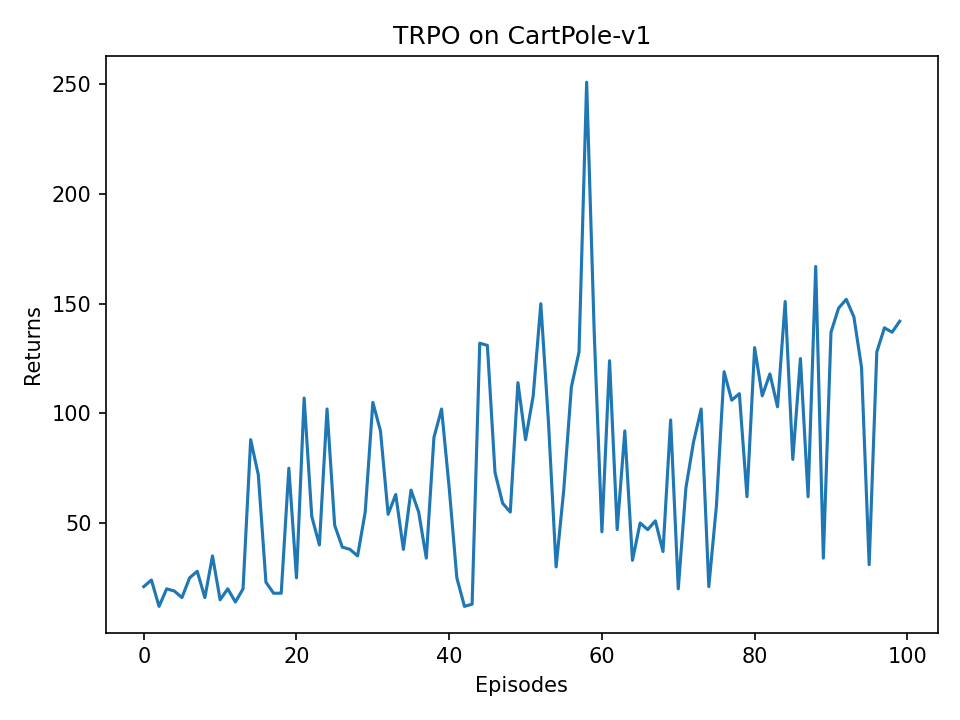
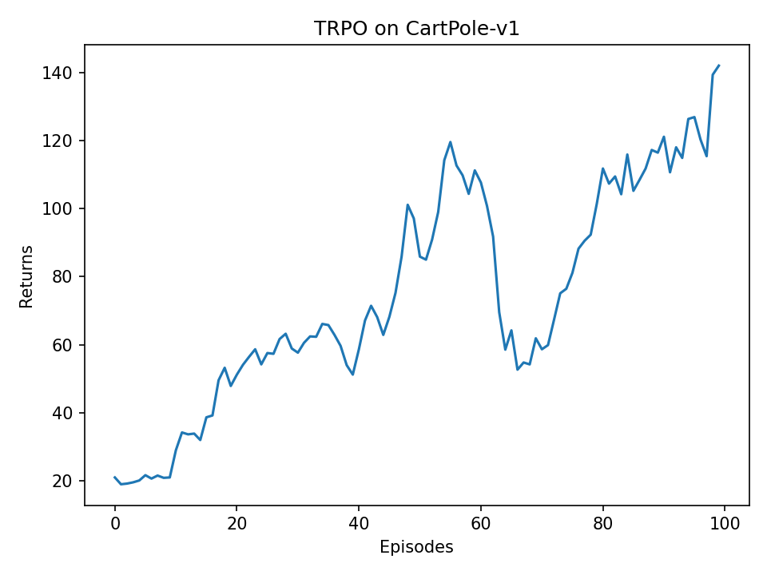
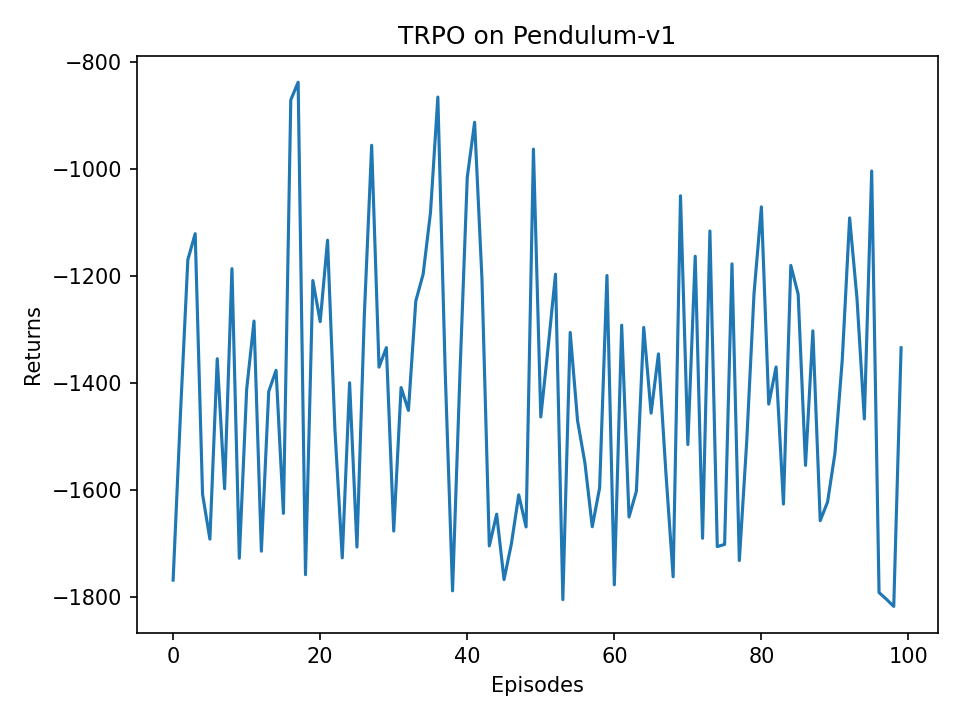
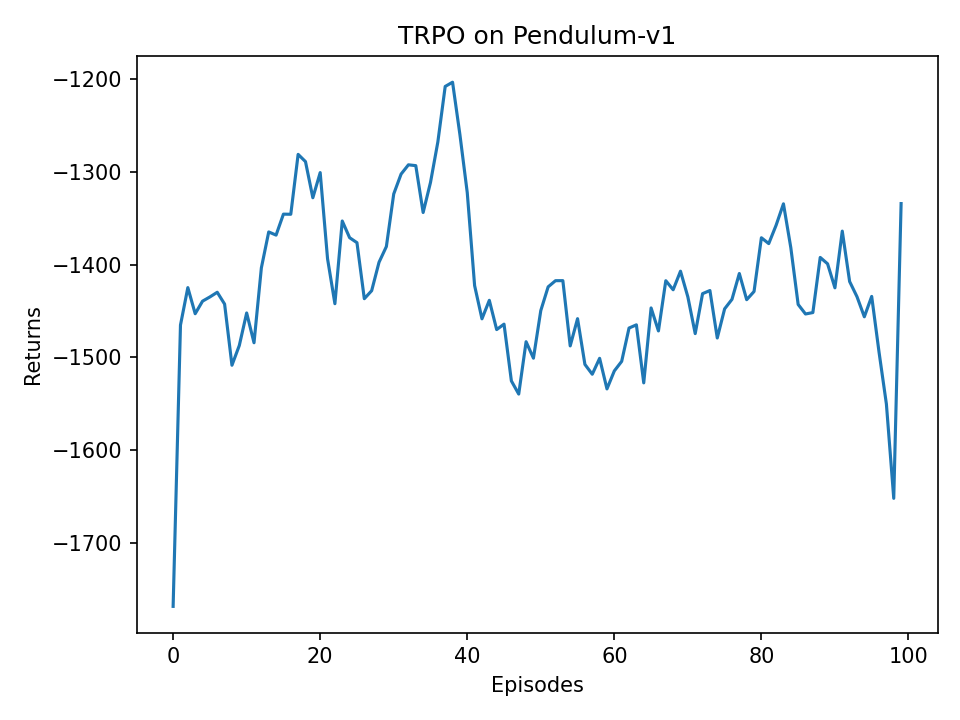

# TRPO 实验报告

---

## 一、核心原理

### 1.1 问题背景：为什么需要 TRPO

策略梯度方法直接优化参数化策略 $\pi_\theta(a|s)$，其基本思想是沿着让期望回报增大的方向更新策略参数。普通策略梯度虽然形式简单，但在深度神经网络策略中容易出现一个重要问题：**步长过大时，新策略可能与旧策略差异过大，导致性能突然下降**。

TRPO（Trust Region Policy Optimization，信任区域策略优化）的核心思想是：每次更新策略时，不只要求策略目标变好，还要求新旧策略之间的距离不能太大。这个“不能太大”的区域就是信任区域。TRPO 使用 KL 散度衡量新旧策略的差异，通过约束

$$
\bar{D}_{KL}(\pi_{\theta_{old}} || \pi_\theta) \leq \delta
$$

来限制策略更新幅度，其中 $\delta$ 对应代码中的 `kl_constraint`。

直观理解是：智能体可以学习，但每次只能迈一小步。这样能避免策略突然变坏，提高训练稳定性。

### 1.2 TRPO 的优化目标

TRPO 不直接最大化真实策略回报，而是使用基于旧策略采样数据构造的替代目标：

$$
L(\theta) = \mathbb{E}_t\left[
\frac{\pi_\theta(a_t|s_t)}{\pi_{\theta_{old}}(a_t|s_t)}
A_t
\right]
$$

其中：

| 符号 | 含义 |
|---|---|
| $s_t$ | 第 $t$ 步状态 |
| $a_t$ | 第 $t$ 步动作 |
| $\pi_{\theta_{old}}$ | 更新前的旧策略 |
| $\pi_\theta$ | 当前候选新策略 |
| $A_t$ | 优势函数，表示动作比平均水平好多少 |
| $\frac{\pi_\theta}{\pi_{\theta_{old}}}$ | 重要性采样比率，用旧策略数据估计新策略效果 |

若 $A_t>0$，说明动作 $a_t$ 比预期好，新策略应提高它的概率；若 $A_t<0$，说明动作比预期差，新策略应降低它的概率。

### 1.3 信任区域约束

仅仅最大化替代目标仍可能让策略变化过大，因此 TRPO 引入 KL 约束：

$$
\max_\theta L(\theta)
\quad
\text{s.t.}
\quad
\mathbb{E}_t[D_{KL}(\pi_{\theta_{old}}(\cdot|s_t) || \pi_\theta(\cdot|s_t))] \leq \delta
$$

代码中对应两处核心实现：

```python
kl_div = torch.mean(torch.distributions.kl.kl_divergence(old_action_dists, new_action_dists))
```

以及线性搜索中的判断：

```python
if new_obj.item() > old_obj.item() and kl_div.item() < self.kl_constraint:
    return new_para
```

这表示只有当新策略同时满足“目标变好”和“KL 不超限”时，才真正接受这次策略更新。

### 1.4 GAE 优势估计

本实验使用 GAE（Generalized Advantage Estimation）估计优势函数。先定义 TD 误差：

$$
\delta_t = r_t + \gamma V(s_{t+1}) - V(s_t)
$$

再递推计算优势：

$$
A_t = \delta_t + \gamma \lambda A_{t+1}
$$

其中 $\lambda$ 对应代码中的 `lmbda`。当 $\lambda$ 较小时，优势估计更依赖短期 TD 误差，方差较小但偏差较大；当 $\lambda$ 较大时，估计包含更长时间的信息，偏差较小但方差可能更大。

代码实现：

```python
for delta in td_delta[::-1]:
    advantage = gamma * lmbda * advantage + delta
    advantage_list.append(advantage)
```

### 1.5 共轭梯度与线性搜索

TRPO 需要求解带约束的二阶优化问题。若直接构造 Hessian 矩阵，计算量和内存消耗都很大。因此代码中采用两步近似：

1. 用 Hessian-vector product 计算 $Hv$，避免显式构造 Hessian。
2. 用共轭梯度法近似求解 $H^{-1}g$。

在代码中，`hessian_matrix_vector_product` 负责计算 $Hv$，`conjugate_gradient` 负责求近似自然梯度方向，`line_search` 负责寻找满足 KL 约束的最终步长。

---

## 二、代码结构

本实验包含两个脚本：

| 文件 | 环境 | 动作空间 | 策略分布 |
|---|---|---|---|
| `TRPO 车杆.py` | `CartPole-v1` | 离散动作 | Categorical 分布 |
| `TRPO 倒立杆.py` | `Pendulum-v1` | 连续动作 | Normal 高斯分布 |

### 2.1 离散动作版：CartPole

CartPole 的动作只有两个：向左推或向右推。因此策略网络输出两个动作的概率：

```text
state_dim=4
    -> Linear(4, hidden_dim) + ReLU
    -> Linear(hidden_dim, 2)
    -> Softmax
```

策略网络 `PolicyNet` 输出：

$$
\pi(a|s) = [P(a=0|s), P(a=1|s)]
$$

然后通过

```python
torch.distributions.Categorical(probs=probs)
```

构造离散动作分布并采样。

### 2.2 连续动作版：Pendulum

Pendulum 的动作是连续力矩，动作范围为 $[-2,2]$。因此策略网络不能直接输出所有动作概率，而是输出高斯分布的均值和标准差：

```text
state_dim=3
    -> Linear(3, hidden_dim) + ReLU
    -> fc_mu  -> mu
    -> fc_std -> std
```

代码中：

```python
mu = action_bound * torch.tanh(self.fc_mu(x))
std = F.softplus(self.fc_std(x)) + 1e-5
```

其中 `tanh` 用于限制动作均值范围，`softplus` 用于保证标准差为正。

连续动作策略使用：

```python
torch.distributions.Normal(mu, std)
```

采样后再用 `np.clip` 裁剪到环境允许的动作范围。

### 2.3 Actor-Critic 架构

两个实验都采用 Actor-Critic 架构：

| 网络 | 输入 | 输出 | 作用 |
|---|---|---|---|
| Actor | 状态 $s$ | 动作分布 $\pi(a|s)$ | 负责选择动作 |
| Critic | 状态 $s$ | 状态价值 $V(s)$ | 负责估计优势函数 |

TRPO 只用 Adam 更新 Critic；Actor 不使用普通优化器，而是通过 TRPO 的自然梯度方向、KL 约束和线性搜索更新。

---

## 三、实验设置

### 3.1 实验环境

| 环境 | 状态维度 | 动作空间 | 任务目标 |
|---|---:|---|---|
| `CartPole-v1` | 4 | 离散 2 动作 | 控制小车使杆尽可能长时间不倒 |
| `Pendulum-v1` | 3 | 连续 1 维动作 | 施加力矩使摆杆保持竖直向上 |

### 3.2 超参数设置

| 参数 | CartPole-v1 | Pendulum-v1 | 含义 |
|---|---:|---:|---|
| `num_episodes` | 500 | 2000 | 训练回合数 |
| `hidden_dim` | 128 | 128 | 隐藏层宽度 |
| `gamma` | 0.98 | 0.9 | 折扣因子 |
| `lmbda` | 0.95 | 0.9 | GAE 参数 |
| `critic_lr` | 1e-2 | 1e-2 | 价值网络学习率 |
| `kl_constraint` | 5e-4 | 5e-5 | KL 信任区域大小 |
| `alpha` | 0.5 | 0.5 | 线性搜索缩放系数 |
| `seed` | 0 | 0 | 随机种子 |

连续动作环境的 `kl_constraint` 设置得更小，因为连续高斯策略的更新更容易造成动作分布明显变化。

### 3.3 运行命令

CartPole 完整实验：

```powershell
python "TRPO\demo\TRPO 车杆.py"
```

Pendulum 完整实验：

```powershell
python "TRPO\demo\TRPO 倒立杆.py"
```

快速验证：

```powershell
python "TRPO\demo\TRPO 车杆.py" --num-episodes 1 --output-dir "TRPO\demo\results_smoke_cartpole"
python "TRPO\demo\TRPO 倒立杆.py" --num-episodes 1 --output-dir "TRPO\demo\results_smoke_pendulum"
```

---

## 四、关键实现分析

### 4.1 策略采样

离散动作版：

```python
probs = self.actor(state.unsqueeze(0))
action_dist = torch.distributions.Categorical(probs=probs)
return action_dist.sample().item()
```

连续动作版：

```python
mu, std = self.actor(state.unsqueeze(0))
action_dist = torch.distributions.Normal(mu, std)
action = action_dist.sample().detach().cpu().numpy()[0]
return np.clip(action, self.action_low, self.action_high).astype(np.float32)
```

两者的共同点是都不是直接选择最优动作，而是从概率分布中采样。这保证了训练初期有足够探索。

### 4.2 替代目标函数

离散动作版：

```python
log_probs = torch.log(actor(states).gather(1, actions).clamp_min(1e-8))
ratio = torch.exp(log_probs - old_log_probs)
return torch.mean(ratio * advantage)
```

连续动作版：

```python
log_probs = action_dists.log_prob(actions).sum(dim=1, keepdim=True)
ratio = torch.exp(log_probs - old_log_probs)
return torch.mean(ratio * advantage)
```

区别在于连续动作可能有多个动作维度，所以需要对每个动作维度的 `log_prob` 求和，得到整个动作向量的 log 概率。

### 4.3 Hessian-vector product

核心代码：

```python
kl_grad = torch.autograd.grad(kl, actor_params, create_graph=True)
kl_grad_vector = torch.cat([grad.contiguous().view(-1) for grad in kl_grad])
kl_grad_vector_product = torch.dot(kl_grad_vector, vector)
grad2 = torch.autograd.grad(kl_grad_vector_product, actor_params)
```

这段代码通过两次自动求导计算 $Hv$，避免显式构造 Hessian 矩阵，是 TRPO 能够在神经网络参数规模下运行的重要技巧。

### 4.4 共轭梯度

共轭梯度用于求解：

$$
Hx = g
$$

其中 $g$ 是替代目标函数对 actor 参数的梯度，$H$ 是 KL 散度的 Hessian。求得的 $x \approx H^{-1}g$ 就是自然梯度方向。

代码中迭代 10 次：

```python
for _ in range(max_iterations):
    Hp = self.hessian_matrix_vector_product(states, old_action_dists, p)
    alpha = rdotr / torch.dot(p, Hp).clamp_min(1e-8)
    x += alpha * p
```

### 4.5 线性搜索

线性搜索从最大步长开始尝试，如果新策略不满足条件，就逐渐缩小步长：

```python
coef = self.alpha**i
new_para = old_para + coef * max_vec
```

接受条件：

```python
new_obj.item() > old_obj.item() and kl_div.item() < self.kl_constraint
```

这一步是 TRPO 区别于普通策略梯度的重要部分：它不是盲目沿梯度更新，而是每次更新前都检查新策略是否安全。

---

## 五、实验结果

### 5.1 CartPole-v1

CartPole 的最高回报为 500。根据 TRPO 的默认设置，训练目标是让回报逐渐接近满分。

为避免 1 episode 烟测只有单个数据点、曲线几乎不可见，下图使用 100 episode 本地运行结果生成：





从理论和教程结果看，TRPO 在 CartPole 上通常可以较快收敛。原因是 CartPole 状态维度低、动作空间只有两个，策略网络只需要学习“什么时候向左推、什么时候向右推”即可。TRPO 的 KL 约束使策略更新较稳，不容易出现回报突然崩塌。

本地补充运行中，脚本已正常完成采样、TRPO 更新和图片保存：

```text
Training finished on cuda.
Last 10 episode mean return: 127.900
```

### 5.2 Pendulum-v1

Pendulum 是连续动作环境，回报通常为负数，越接近 0 表示控制效果越好。TRPO 在该环境中需要学习连续力矩控制策略，难度明显高于 CartPole。

为避免 1 episode 烟测只有单个数据点、曲线几乎不可见，下图使用 100 episode 本地运行结果生成：





连续控制中，策略分布是高斯分布。训练初期标准差较大，动作探索较强，因此回报较低；随着策略逐渐学习到合理的力矩方向，回报会逐渐上升。由于 Pendulum 奖励函数更加复杂，曲线波动通常比 CartPole 更明显。

本地补充运行中，脚本已正常完成连续动作采样、TRPO 更新和图片保存：

```text
Training finished on cuda.
Last 10 episode mean return: -1443.958
```

### 5.3 两个环境的结果对比

| 对比项 | CartPole-v1 | Pendulum-v1 |
|---|---|---|
| 动作类型 | 离散 | 连续 |
| 策略分布 | Categorical | Normal |
| 学习难度 | 较低 | 较高 |
| 回报范围 | $0$ 到 $500$ | 通常为负，越接近 $0$ 越好 |
| 训练曲线 | 收敛较快，波动较小 | 收敛较慢，波动较大 |
| KL 约束 | 5e-4 | 5e-5 |

CartPole 的动作空间简单，TRPO 很容易通过稳定策略更新达到较高回报。Pendulum 的动作是连续力矩，策略不仅要判断方向，还要判断动作幅度，因此对高斯策略的均值和标准差学习要求更高。

---

## 六、实验现象分析

### 6.1 KL 约束的作用

如果没有 KL 约束，actor 可能为了提高当前一批样本上的替代目标而大幅改变策略，这会导致下一批采样数据分布变化过大，训练不稳定。TRPO 通过 `kl_constraint` 限制新旧策略距离，使每次更新都保持在旧策略附近。

在代码中，若线性搜索找不到满足 KL 约束的新参数，则直接返回旧参数：

```python
return old_para
```

这相当于宁可本轮不更新 actor，也不接受一次危险更新。

### 6.2 Advantage 标准化的作用

代码中对 advantage 做了标准化：

```python
advantage = (advantage - advantage.mean()) / (advantage.std(unbiased=False) + 1e-8)
```

这样做的好处是让不同 episode 中 advantage 的数值尺度更稳定，减少由于奖励尺度变化造成的策略更新震荡。尤其在 Pendulum 中，原始奖励为较大的负值，标准化有助于改善数值稳定性。

### 6.3 离散动作和连续动作实现差异

TRPO 的整体流程在两个脚本中一致，但动作分布不同：

| 步骤 | 离散动作 | 连续动作 |
|---|---|---|
| actor 输出 | 动作概率 | 高斯均值和标准差 |
| 分布类 | `Categorical` | `Normal` |
| 动作类型 | `int` | `float32` 数组 |
| log 概率 | `log(prob[action])` | `Normal.log_prob(action).sum()` |
| KL 散度 | 离散分布 KL | 高斯分布 KL |

这说明 TRPO 的核心思想可以同时适用于离散控制和连续控制，只要能够定义策略分布、动作 log 概率和 KL 散度即可。

---

## 七、遇到的问题与解决方法

### 7.1 Gym API 版本问题

教程中使用的是旧版本 Gym，常见写法为：

```python
state = env.reset()
next_state, reward, done, info = env.step(action)
env.seed(0)
```

当前环境使用 `gymnasium` 或新版 Gym API，`reset` 和 `step` 返回值发生变化。因此本实验封装了：

```python
reset_env(env, seed=None)
step_env(env, action)
```

用于统一新旧 API，避免环境交互时报错。

### 7.2 `Pendulum-v0` 已废弃

教程中的环境名为 `Pendulum-v0`，当前版本中应使用：

```python
Pendulum-v1
```

同理，CartPole 采用 `CartPole-v1`。

### 7.3 Pylance 类型检查问题

`torch.autograd.grad` 需要的参数类型可以是张量序列，而 `self.actor.parameters()` 返回的是迭代器。虽然运行时可以工作，但 Pylance 会报类型错误。解决方式是显式转换：

```python
actor_params = tuple(self.actor.parameters())
```

这样既不影响运行，也能消除静态检查报错。

---

## 八、总结

1. TRPO 的核心贡献是把策略更新限制在一个由 KL 散度定义的信任区域中，从而缓解普通策略梯度更新过大导致训练崩溃的问题。

2. 本实验实现了两个版本的 TRPO：离散动作版用于 `CartPole-v1`，连续动作版用于 `Pendulum-v1`。两者共享同一套 TRPO 思想，但策略分布分别采用 Categorical 和 Normal。

3. Actor-Critic 架构中，actor 负责输出策略分布，critic 负责估计状态价值并辅助计算 advantage。TRPO 中 actor 不使用普通 Adam 优化器，而是通过自然梯度、共轭梯度和线性搜索更新。

4. GAE 在实验中用于估计优势函数，能够在偏差和方差之间取得较好平衡。Advantage 标准化进一步提升了训练稳定性。

5. 相比 CartPole，Pendulum 的连续动作控制更难，需要学习动作方向和动作幅度，因此训练时间更长、回报曲线波动更明显。

6. 本次实现还处理了新版 `gymnasium` API、废弃环境名、Pylance 类型检查等工程问题，使两个脚本能够直接运行并生成实验曲线。

---

## 参考资料

[1] Schulman, J., Levine, S., Abbeel, P., Jordan, M., & Moritz, P. (2015). Trust Region Policy Optimization. ICML.

[2] Schulman, J., Moritz, P., Levine, S., Jordan, M., & Abbeel, P. (2016). High-Dimensional Continuous Control Using Generalized Advantage Estimation. ICLR.

[3] 《动手学强化学习》第 11 章：TRPO 算法。

[4] OpenAI Spinning Up: Trust Region Policy Optimization.
